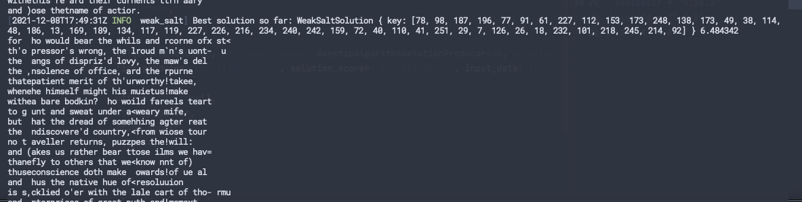
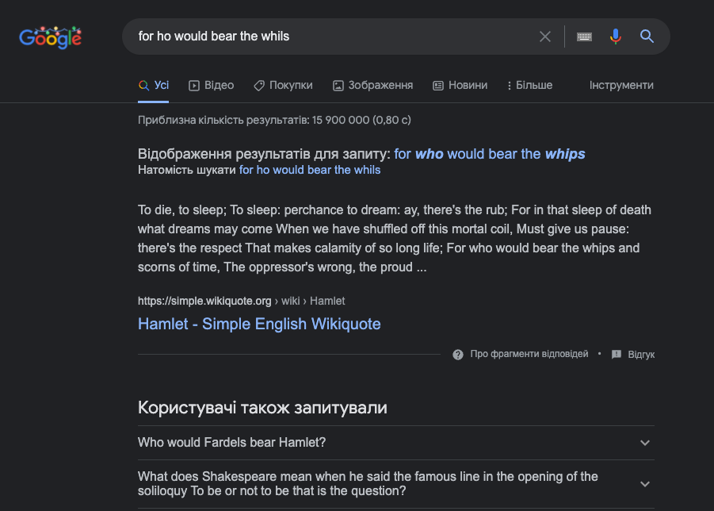

# Weak Salt

The task states that salsa20 with the same key and without nonce is used, meaning that every line of the 
text is XORed with the same key.

To crack this encryption, we need to guess this key, which was re-used for each line.

I am re-using the genetic algorithm I implemented in previous assignments.
I try various keys and choose the one which maximizes the following function:

F = 0.1 * 1grams + 0.5 * 2grams + 3grams

(I tried including some metric of total valid words or symbols, but it didn't improve time to converge to a valid solution)

ngrams were extracted from Project Gutenberg's file with Shakespeare works (pure coincidence, I wasn't aware of the author of the lines at the of the writing).

Genetic algorthim coverges to a solution which looks readable:

An attempt to find the first line on Google:

The author of these lines in Shakespeare.